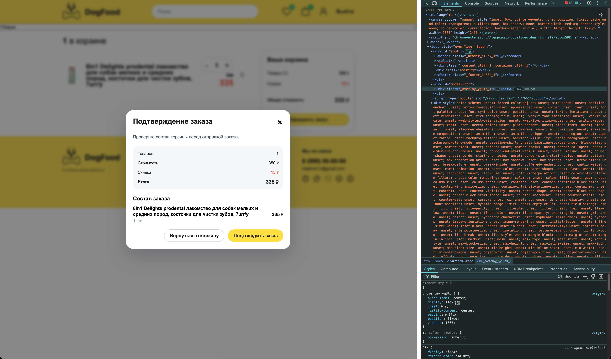
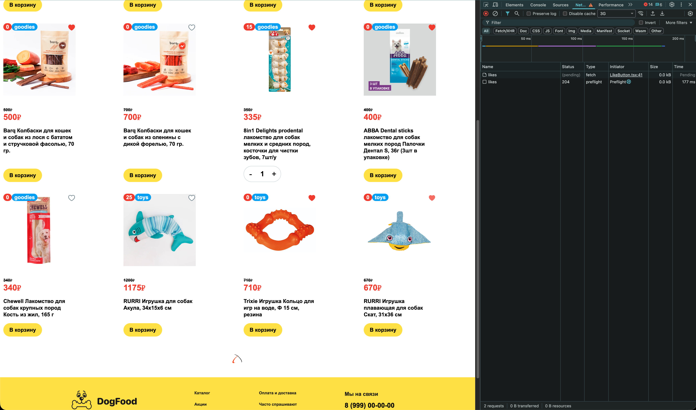
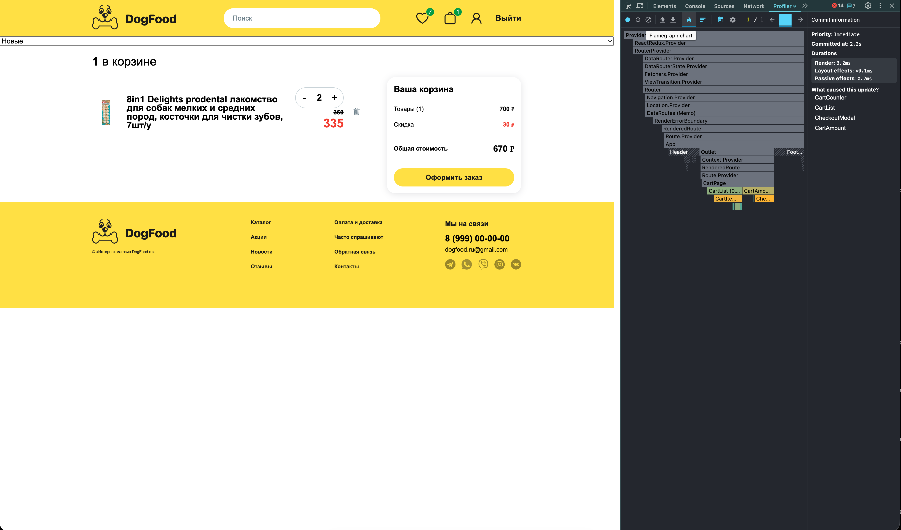

# Итоговый проект

## Что сделано

1. Архитектура и структура

- Общие презентационные компоненты вынесены в `src/shared/ui`: `Button`, `Input`, `Loader`, `Modal`.
- Код распределен по слоям `shared`, `features`, `pages`.
- Фичи изолированы по папкам: `auth`, `cart`, `search`, `reviews`, `products`.
- Лишний prop drilling убран из корзины через селекторы `cartSelectors`.

2. Оптимизация рендеров

- В качестве hotspot использовался сценарий изменения количества товара в корзине и повторные ререндеры карточек каталога.
- `React.memo` добавлен для `Card`, `CardList`, `CartItem`, `LikeButton`.
- В корзине обновляется только измененный товар, без пересоздания всего массива.
- В `Header` добавлен `useMemo` для подсчета лайков, а в селекторах убраны лишние подписки на весь массив корзины.

3. React.Portal

- В `public/index.html` добавлен `#modal-root`.
- Реализована `Modal` через `createPortal`.
- Поддержаны закрытие по `ESC`, по клику на overlay и по кнопке-крестику.
- При открытии фокус уходит на кнопку закрытия, при закрытии возвращается на кнопку-триггер.

4. useRef

- В формах авторизации и регистрации реализован автофокус на поле email.
- В `SignInForm` через `useRef` хранится счетчик попыток отправки без лишнего ререндера.
- В модалке `useRef` используется для управления фокусом и возврата фокуса на триггер.

5. Альтернативная сборка

- Добавлена вторая сборка на `Vite + SWC`.
- Настроены команды `npm run start:vite`, `npm run build:vite`, `npm run preview:vite`.
- Для совместимости webpack и Vite обновлена обработка `svg`-иконок.

6. React 19 hooks

- Проект обновлен до `React 19.1.1`.
- В `LikeButton` использован `useOptimistic` для мгновенной реакции UI при добавлении и удалении лайка.
- Добавлены pending-состояние и обработка ошибки запроса.

## Структура папок

- `src/app` — корневой слой приложения, глобальные стили и общий каркас.
- `src/pages` — страницы маршрутов: каталог, товар, корзина, профиль, авторизация.
- `src/features` — изолированные пользовательские сценарии: авторизация, корзина, поиск, отзывы, лайки.
- `src/shared` — переиспользуемые UI-компоненты, store, api, hooks, utils, assets и типы.
- `src/widgets` — композиционные блоки страницы: `Header`, `Footer`, `CardList`.

Ключевые директории:

- `src/features/auth` — формы входа и регистрации, схемы валидации и типы.
- `src/features/cart` — модалка оформления заказа и связанные cart-компоненты.
- `src/features/search` — поиск, сортировка и логика query-параметров.
- `src/features/reviews` — список отзывов и форма отзыва.
- `src/shared/ui` — только презентационные компоненты без store, API и бизнес-логики.

## Команды

- `npm install` — установка зависимостей.
- `npm start` — запуск проекта через webpack dev server.
- `npm run start:vite` — запуск проекта через Vite.
- `npm run build` — production-сборка через webpack.
- `npm run build:vite` — production-сборка через Vite.

## Сравнение сборок

Замер выполнен командами:

```bash
/usr/bin/time -p npm run build
/usr/bin/time -p npm run build:vite
```

Результат:

| Сборка     | Время         | JS                           | CSS                        | HTML        | Размер папки |
| ---------- | ------------- | ---------------------------- | -------------------------- | ----------- | ------------ |
| Webpack    | `real 10.44s` | `650135` bytes (`635 KiB`)   | `54745` bytes (`53.5 KiB`) | `434` bytes | `756K`       |
| Vite + SWC | `real 2.03s`  | `661800` bytes (`661.80 kB`) | `41719` bytes (`41.71 kB`) | `415` bytes | `712K`       |

Краткий вывод:

- `Vite + SWC` собирает проект заметно быстрее, чем `webpack` на текущем коде.
- У `vite` итоговая папка сборки меньше, а CSS получается компактнее.
- Основной JS-файл у `vite` чуть больше.

## Демонстрация

1. Portal-модалка

- Открыть страницу `/cart`.
- Добавить товары в корзину и нажать `Оформить заказ`.
- Проверить открытие через портал, закрытие по overlay, `ESC`, крестику и возврат фокуса на кнопку-триггер.

2. React 19 `useOptimistic`

- Открыть каталог или страницу товара.
- Нажать на кнопку лайка в авторизованном состоянии.
- Иконка меняет состояние сразу, до завершения запроса, и блокируется на время pending-состояния.

3. Оптимизация рендеров

- Открыть React DevTools Profiler.
- Записать сценарий изменения количества одного товара в корзине.
- Проверить, что после оптимизаций меньше затрагиваются соседние карточки и элементы списка.

4. useRef

- Открыть `/signin` или `/signup`.
- Убедиться, что фокус при открытии страницы сразу стоит в поле email.
- При повторных ошибках входа счетчик попыток меняется через ref без отдельного состояния компонента.

### Portal-модалка



### Optimistic UI



### Profiler


