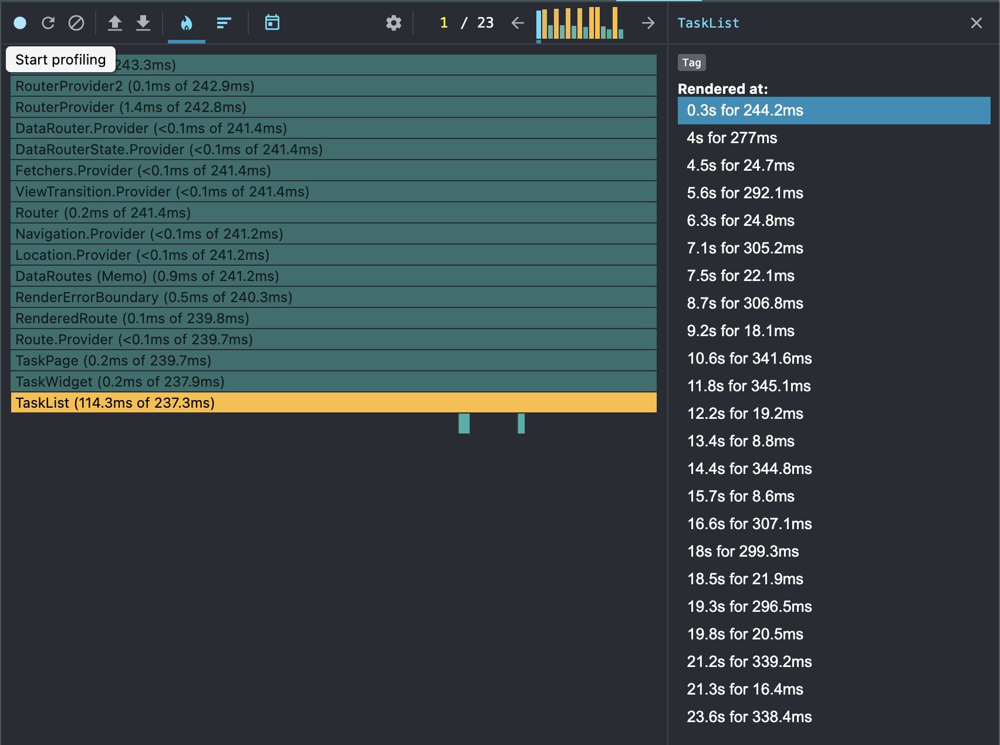
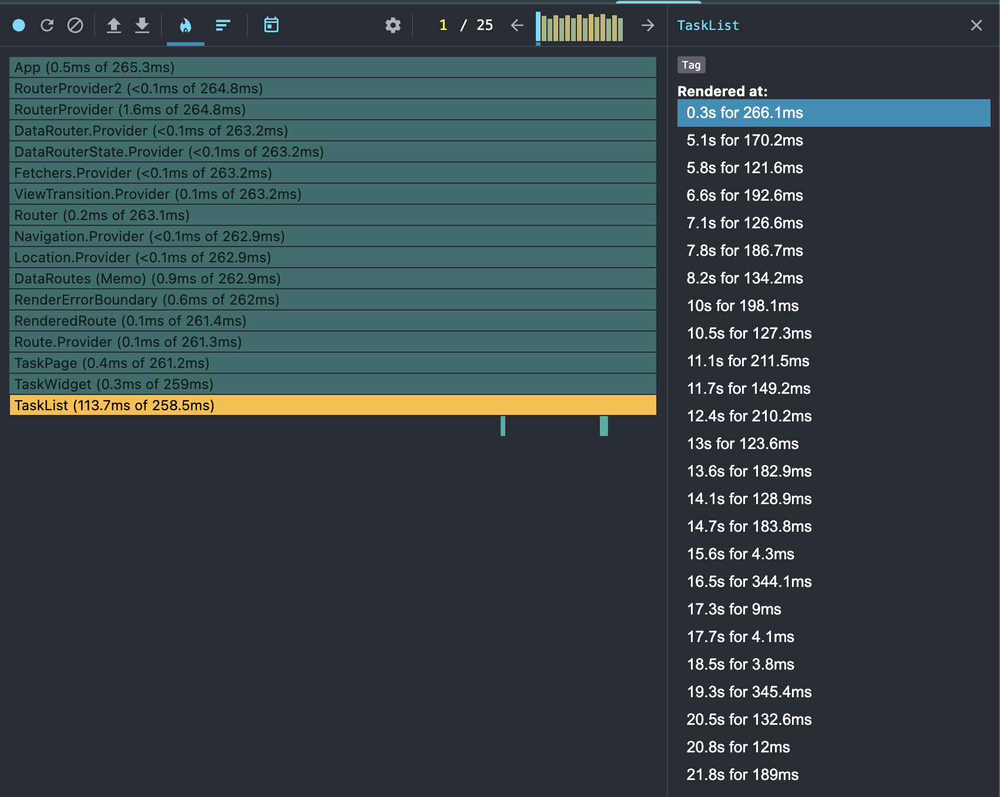

## Скриншот до оптимизации:


- в данном случае достаточно взглянуть на среднее время рендера списка тасок на каждый ре-рендер (Цифры в районе 300-340ms)

## Скриншот после оптимизации:


- в данном случае достаточно взглянуть на среднее время рендера списка тасок на каждый ре-рендер (Цифры в районе 120-210ms)

## Для генерации тасок использовал функцию:

```js
function generateTasks(): Task[] {
    const tasks: Task[] = [];

    for (let i = 0; i < 1000; i++) {
        tasks.push({id: String(i), title: `title-${i}`, completed: false})
    }

    return tasks;
}
```